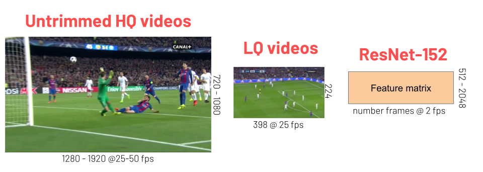

# How to download SoccerNet?

You can use the pip package for that purpose:

```bash
pip install SoccerNet --upgrade
```

Then use the API to downlaod the data of interest:

```
import SoccerNet
from SoccerNet.Downloader import SoccerNetDownloader

mySoccerNetDownloader = SoccerNetDownloader(
    LocalDirectory="/path/to/SoccerNet")

# download labels SN v2
mySoccerNetDownloader.downloadGames(files=["Labels-v2.json"], split=["train","valid","test"])
# download labels for camera shot
mySoccerNetDownloader.downloadGames(files=["Labels-cameras.json"], split=["train","valid","test"]) 

# download Features reduced with PCA
mySoccerNetDownloader.downloadGames(files=["1_ResNET_TF2_PCA512.npy", "2_ResNET_TF2_PCA512.npy"], split=["train","valid","test","challenge"])

```

If you want to download the videos, you will need to fill a NDA to get the password.

```
mySoccerNetDownloader.password = input("Password for videos?:\n")

# download LQ (224p) Videos
mySoccerNetDownloader.downloadGames(files=["1_224p.mkv", "2_224p.mkv"], split=["train","valid","test","challenge"])

# download HQ (720p) Videos
mySoccerNetDownloader.downloadGames(files=["1_720p.mkv", "2_720p.mkv"], split=["train","valid","test","challenge"])
```
## What data are available for Download?

<p align="center"></p>

### Annotations

- **Labels-v2.json**: Labels from SoccerNet-v2 - action spotting
- **Labels-cameras.json**: Labels from SoccerNet-v1 - camera shot segmentation
- **Labels.json**: Labels from SoccerNet-v1 - action spotting for goals/cards/subs only
- **Labels-replays.json** Labels from SoccerNet-v2 - replay grounding (Download [Challenge set](https://github.com/SilvioGiancola/SoccerNetv2-DevKit/blob/main/Task3-ReplayGrounding/replay_labels_challenge.zip) )

## Pre-extracted Features

- **1_ResNET_TF2.npy**: ResNET features @2fps for 1st half from SoccerNet-v2, [extracted using TF2](https://github.com/SilvioGiancola/SoccerNetv2-DevKit/tree/main/Features)
- **2_ResNET_TF2.npy**: ResNET features @2fps for 2nd half from SoccerNet-v2, [extracted using TF2](https://github.com/SilvioGiancola/SoccerNetv2-DevKit/tree/main/Features)
- **1_ResNET_TF2_PCA512.npy**: ResNET features @2fps for 1st half from SoccerNet-v2, [extracted using TF2](https://github.com/SilvioGiancola/SoccerNetv2-DevKit/tree/main/Features), with dimensionality [reduced to 512 using PCA](https://github.com/SilvioGiancola/SoccerNetv2-DevKit/blob/main/Features/ReduceFeaturesPCA.py)
- **2_ResNET_TF2_PCA512.npy**: ResNET features @2fps for 2nd half from SoccerNet-v2, [extracted using TF2](https://github.com/SilvioGiancola/SoccerNetv2-DevKit/tree/main/Features), with dimensionality [reduced to 512 using PCA](https://github.com/SilvioGiancola/SoccerNetv2-DevKit/blob/main/Features/ReduceFeaturesPCA.py)
- **1_ResNET_5fps_TF2.npy**: ResNET features @5fps for 1st half from SoccerNet-v2, [extracted using TF2](https://github.com/SilvioGiancola/SoccerNetv2-DevKit/tree/main/Features)
- **2_ResNET_5fps_TF2.npy**: ResNET features @5fps for 2nd half from SoccerNet-v2, [extracted using TF2](https://github.com/SilvioGiancola/SoccerNetv2-DevKit/tree/main/Features)
- **1_ResNET_5fps_TF2_PCA512.npy**: ResNET features @5fps for 1st half from SoccerNet-v2, [extracted using TF2](https://github.com/SilvioGiancola/SoccerNetv2-DevKit/tree/main/Features), with dimensionality [reduced to 512 using PCA](https://github.com/SilvioGiancola/SoccerNetv2-DevKit/blob/main/Features/ReduceFeaturesPCA.py)
- **2_ResNET_5fps_TF2_PCA512.npy**: ResNET features @5fps for 2nd half from SoccerNet-v2, [extracted using TF2](https://github.com/SilvioGiancola/SoccerNetv2-DevKit/tree/main/Features), with dimensionality [reduced to 512 using PCA](https://github.com/SilvioGiancola/SoccerNetv2-DevKit/blob/main/Features/ReduceFeaturesPCA.py)
- **1_ResNET_25fps_TF2.npy**: ResNET features @25fps for 1st half from SoccerNet-v2, [extracted using TF2](https://github.com/SilvioGiancola/SoccerNetv2-DevKit/tree/main/Features)
- **2_ResNET_25fps_TF2.npy**: ResNET features @25fps for 2nd half from SoccerNet-v2, [extracted using TF2](https://github.com/SilvioGiancola/SoccerNetv2-DevKit/tree/main/Features)

### Legacy from SoccerNet-v1

- **1_C3D.npy**: C3D features @2fps for 1st half from SoccerNet-v1
- **2_C3D.npy**: C3D features @2fps for 2nd half from SoccerNet-v1
- **1_C3D_PCA512.npy**: C3D features @2fps for 1st half from SoccerNet-v1, with dimensionality reduced to 512 using PCA
- **2_C3D_PCA512.npy**: C3D features @2fps for 2nd half from SoccerNet-v1, with dimensionality reduced to 512 using PCA
- **1_I3D.npy**: I3D features @2fps for 1st half from SoccerNet-v1
- **2_I3D.npy**: I3D features @2fps for 2nd half from SoccerNet-v1
- **1_I3D_PCA512.npy**: I3D features @2fps for 1st half from SoccerNet-v1, with dimensionality reduced to 512 using PCA
- **2_I3D_PCA512.npy**: I3D features @2fps for 2nd half from SoccerNet-v1, with dimensionality reduced to 512 using PCA
- **1_ResNET.npy**: ResNET features @2fps for 1st half from SoccerNet-v1
- **2_ResNET.npy**: ResNET features @2fps for 2nd half from SoccerNet-v1
- **1_ResNET_PCA512.npy**: ResNET features @2fps for 1st half from SoccerNet-v1, with dimensionality reduced to 512 using PCA
- **2_ResNET_PCA512.npy**: ResNET features @2fps for 2nd half from SoccerNet-v1, with dimensionality reduced to 512 using PCA

## Videos (requires a password to download - please fill this [NDA](https://soccer-net.org) to request access)

- **1_224p.mkv**: LQ video 1st half - timmed with start/duration from HQ video - resolution 224*398 - 25 fps
- **2_224p.mkv**: LQ video 2nd half - timmed with start/duration from HQ video - resolution 224*398 - 25 fps
- **1_720p.mkv**: HQ video 1st half - timmed with start/duration from HQ video - resolution 720*1080 - 25 fps
- **2_720p.mkv**: HQ video 2nd half - timmed with start/duration from HQ video - resolution 720*1080 - 25 fps
