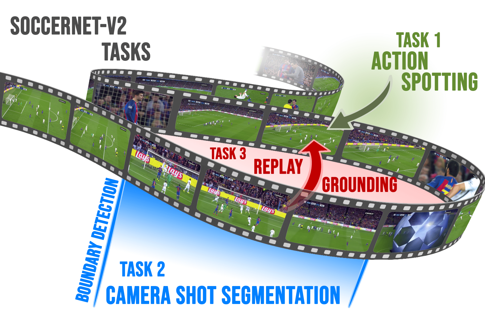

# SoccerNetv2-DevKit

Welcome to the SoccerNet-V2 Development Kit for the SoccerNet Benchmark and Challenge. This kit is meant as a help to get started working with the soccernet data and the proposed tasks. More information about the dataset can be found on our [official website](https://www.soccer-net.org).

SoccerNet-v2 is an extension of SoccerNet-v1 with new and challenging tasks including
action spotting, camera shot segmentation with boundary detection, and a novel replay grounding task.

<p align="center"></p>

The dataset consists of 500 complete soccer games including:
 - Full untrimmed broadcast videos in both low and high resolution.
 - Pre-computed features such as ResNET-152.
 - Annotations of actions among 17 classes (Labels-v2.json).
 - Annotations of camera replays linked to actions (Labels-cameras.json).
 - Annotations of camera changes and camera types for 200 games (Labels-cameras.json).


Participate in our upcoming Challenge in the [CVPR 2021 International Challenge on Activity Recognition Workshop](http://activity-net.org/challenges/2021/index.html) and try to win up to 1000$ sponsored by [Second Spectrum](https://www.secondspectrum.com/index.html)! All details can be found on the [challenge website](https://eval.ai/web/challenges/challenge-page/761/overview), or on the [main page](https://soccer-net.org/).

The participation deadline is fixed at the 30th of May 2021.
The official rules and guidelines are available on [ChallengeRules.md](ChallengeRules.md).

<a href="https://youtu.be/T8Qc39FcQ7A">
<p align="center"></p>
</a>

## How to download SoccerNet-v2 

A [SoccerNet pip package](https://pypi.org/project/SoccerNet/) to easily download the data and the annotations is available. 

To install the pip package simply run:

<code>pip install SoccerNet</code>

Please follow the instructions provided in the [Download](Download) folder of this repository. Do also mind that signing an Non-Disclosure agreement (NDA) is required to access the LQ and HQ videos: [NDA](https://docs.google.com/forms/d/e/1FAIpQLSfYFqjZNm4IgwGnyJXDPk2Ko_lZcbVtYX73w5lf6din5nxfmA/viewform).

## How to extract video features 

As it was one of the most requested features on SoccerNet-V1, this repository provides functions to automatically extract the ResNet-152 features and compute the PCA on your own broadcast videos. These functions allow you to test pre-trained action spotting, camera segmentation or replay grounding models on your own games.

The functions to extract the video features can be found in the [Features](Features) folder.

<p align="center"></p>

## Baseline Implementations

This repository contains several baselines for each task which are presented in the [SoccerNet-V2 paper](https://arxiv.org/pdf/2011.13367.pdf), or subsequent papers. You can use these codes to build upon our methods and improve the performances.

- Action Spotting [[Link]](Task1-ActionSpotting)
- Camera Shot Segmentation [[Link]](Task2-CameraShotSegmentation)
- Replay Grounding [[Link]](Task3-ReplayGrounding)


## Evaluation

This repository and the pip package provide evaluation functions for the three proposed tasks based on predictions saved in the JSON format. See the [Evaluation](Evaluation) folder of this repository for more details.

## Visualizations

Finally, this repository provides the [Annotation tool](Annotation) used to annotate the actions, the camera types and the replays. This tool can be used to visualize the information. Please follow the instruction in the dedicated folder for more details.

## Citation

For further information check out the paper and supplementary material:
https://arxiv.org/abs/2011.13367

Please cite our work if you use our dataset:
```bibtex
@InProceedings{Deliège2020SoccerNetv2,
      title={SoccerNet-v2 : A Dataset and Benchmarks for Holistic Understanding of Broadcast Soccer Videos}, 
      author={Adrien Deliège and Anthony Cioppa and Silvio Giancola and Meisam J. Seikavandi and Jacob V. Dueholm and Kamal Nasrollahi and Bernard Ghanem and Thomas B. Moeslund and Marc Van Droogenbroeck},
      year={2021},
      booktitle = {The IEEE Conference on Computer Vision and Pattern Recognition (CVPR) Workshops},
      month = {June},
}
```
