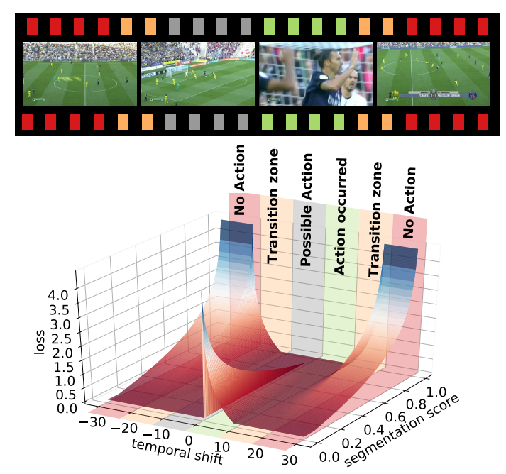
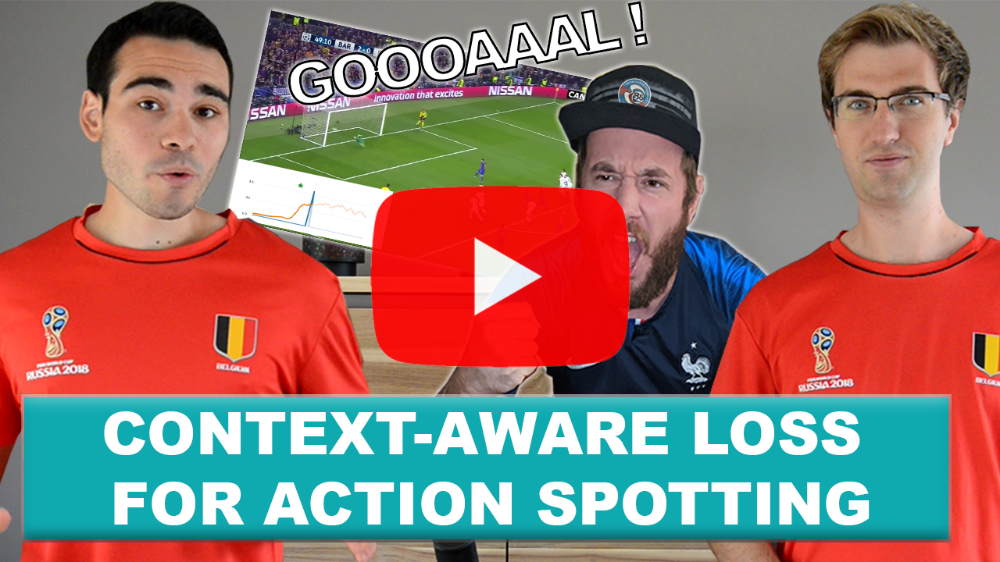
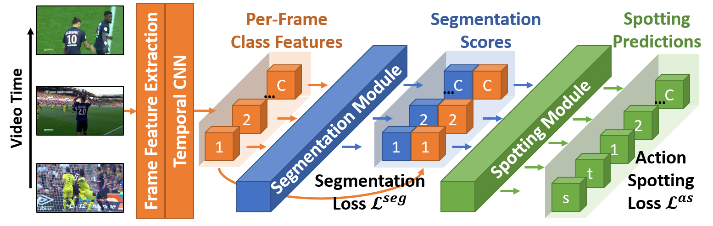

# SoccerNet-v2 - Action Spotting with CALF

This repository contains the code to reproduce the action spotting result of the paper: "SoccerNet-v2 : A Dataset and Benchmarks for Holistic Understanding of Broadcast Soccer Videos" with the CALF method adapted to the 17 classes of SoccerNet-v2. The SoccerNet-v2 paper can be found here: [SoccerNet-v2 paper](https://arxiv.org/pdf/2011.13367.pdf), and the CALF paper "A Context-Aware Loss Function for Action Spotting in Soccer Videos" here: [CALF paper](https://openaccess.thecvf.com/content_CVPR_2020/papers/Cioppa_A_Context-Aware_Loss_Function_for_Action_Spotting_in_Soccer_Videos_CVPR_2020_paper.pdf).


```bibtex
@InProceedings{Deliege2020SoccerNetv2,
  author = { Deliège, Adrien and Cioppa, Anthony and Giancola, Silvio and Seikavandi, Meisam J. and Dueholm, Jacob V. and Nasrollahi, Kamal and Ghanem, Bernard and Moeslund, Thomas B. and Van Droogenbroeck, Marc},
  title = {SoccerNet-v2 : A Dataset and Benchmarks for Holistic Understanding of Broadcast Soccer Videos},
  booktitle = {CoRR},
  month = {Nov},
  year = {2020}
}
```


```bibtex
@InProceedings{Cioppa2020Context,
  author = {Cioppa, Anthony and Deliège, Adrien and Giancola, Silvio and Ghanem, Bernard and Van Droogenbroeck, Marc and Gade, Rikke and Moeslund, Thomas B.},
  title = {A Context-Aware Loss Function for Action Spotting in Soccer Videos},
  booktitle = {The IEEE Conference on Computer Vision and Pattern Recognition (CVPR)},
  month = {June},
  year = {2020}
}
```

The task is to spot 17 types of actions (goals, corners, fouls, ...) in untrimmed broadcast soccer videos. To do so, a custom loss function is used to explicitly model the temporal context around action spots. The main idea behind this loss is to penalize the frames far-distant from the action and steadily decrease the penalty for the frames gradually closer to the action. The frames just before the action are not penalized to avoid providing misleading information as its occurrence is uncertain. However, those just after the action are heavily penalized as we know for sure that the action has occurred.

<p align="center"></p>

For more information about the CALF method, check out our presentation video. To see more of our work, subscribe to our YouTube channel [__Acad AI Research__](https://www.youtube.com/channel/UCYkYA7OwnM07Cx78iZ6RHig?sub_confirmation=1)

<a href="https://www.youtube.com/watch?v=51cyRDcmO00">
<p align="center"></p>
</a>

## Getting Started

The following instructions will help you install the required libraries and the dataset to run the code. The code runs in <code>python 3</code> and was tested in a conda environment. Pytorch is used as deep learning library. An implementation of CALF in Keras for the original SoccerNet dataset is also available on [Github](https://github.com/cioppaanthony/context-aware-loss).


### Create environment

To create and setup the conda environment, simply follow the following steps:

```bash
conda create -n CALF-pytorch python=3.8
conda activate CALF-pytorch
conda install pytorch=1.6 torchvision=0.7 cudatoolkit=10.1 -c pytorch
pip install SoccerNet
```

### Run training and testing

The code for training and testing the network is located inside the <code>src</code> folder under the name <code>main.py</code>. The architecture of the network is in the <code>model.py</code> under the name *ContextAwareModel*. Feel free to change the architecture and test your own!

<p align="center"></p>

To train the network, simply run the following command from the root folder:

```bash
python src/main.py --SoccerNet_path=/path/to/SoccerNet/ \
--features=ResNET_TF2_PCA512.npy \
--num_features=512 \
--model_name=CALF_v2 \
--batch_size 32 \
--evaluation_frequency 20 \
--chunks_per_epoch 18000 \
```

The weights of the network will be saved in the models/model_name/ folder alongside a log file tracing the training parameters and the evolution of the performances. The predictions for the challenge submission on [EvalAI](https://eval.ai/web/challenges/challenge-page/761/overview) (testset split) will be stored in the outputs folder. To submit your results, simply zip the league folders inside a single zip file.

Note that if you did not download the SoccerNet features beforehand, the code will start by downloading them, which might take a bit of time.


To evaluate the results, you have two options. You can either use the predictions in the outputs folder directly with 

```bash
python src/evaluate.py --SoccerNet_path=/path/to/SoccerNet/ \
--Predictions_path outputs/
```

or re-run the model from the main.py file. This option will re-load the weights of your model and predict the results from the features, and save them in json format in the outputs folder:

```bash
python src/main.py --SoccerNet_path=/path/to/SoccerNet/ \
--features=ResNET_TF2_PCA512.npy \
--num_features=512 \
--model_name=CALF_v2 \
--test_only
```


If you wish to use our pre-trained weights, they are located in models/CALF_benchmark/. You can reproduce our results by running:

```bash
python src/main.py --SoccerNet_path=/path/to/SoccerNet/ \
--features=ResNET_TF2_PCA512.npy \
--num_features=512 \
--model_name=CALF_benchmark \
--test_only
```

For producing the results of the challenge, simply use the --challenge parameter. Of course, the performance won't be computed localy since you don't have access to the labels. Upload the predictions saved in the <code>outputs</code> folder on [EvalAI](https://eval.ai/web/challenges/challenge-page/761/overview) to get your challenge performance.

```bash
python src/main.py --SoccerNet_path=/path/to/SoccerNet/ \
--features=ResNET_TF2_PCA512.npy \
--num_features=512 \
--challenge
--model_name=CALF_v2 \
--test_only
```

## Test on external video

If you wish to test a pre-trained network on external videos, first install the following libraries:

```
apt-get install 
pip install scikit-video tensorflow==2.3.0 imutils opencv-python==3.4.11.41 SoccerNet moviepy scikit-learn ffmpy
```

and then run the code using:
```
python inference/main.py --video_path=<path to your video> --model_name CALF_benchmark
```

This will produce 17 temporal images of predictions (one per class, only predictions with confidence scores above 0.34) and a json file containing all predictions in <code>inference/outputs</code>.

## Authors

* **Anthony Cioppa**, University of Liège (ULiège).
* **Adrien Deliège**, University of Liège (ULiège).
* **Silvio Giancola**, King Abdullah University of Science and Technology (KAUST).
* **Meisam J. Seikavandi**,  Aalborg University (AAU).
* **Jacob V. Dueholm**,  Aalborg University (AAU).

See the [AUTHORS](AUTHORS) file for details.


## License

Apache v2.0
See the [LICENSE](LICENSE) file for details.

## Acknowledgments

* Anthony Cioppa is funded by the FRIA, Belgium.
* This work is supported by the DeepSport project of the Walloon Region, at the University of Liège (ULiège), Belgium.
* This work is also supported by the King Abdullah University of Science and Technology (KAUST) Office of Sponsored Research (OSR).
* This work is also supported by the Milestone Research Program at Aalborg University.
