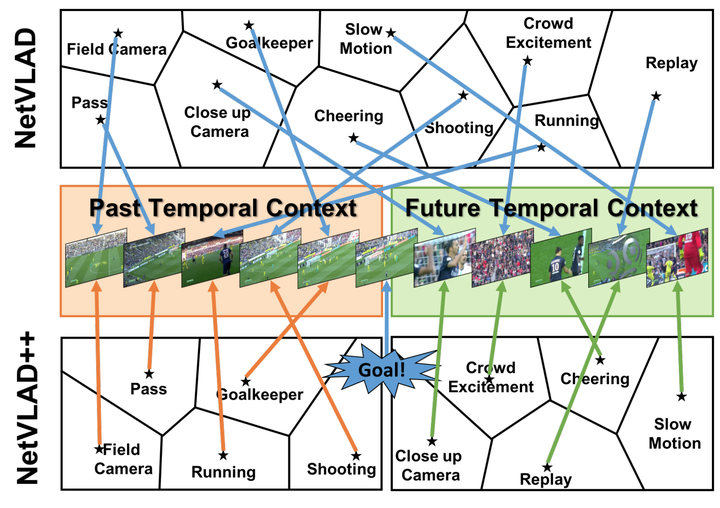
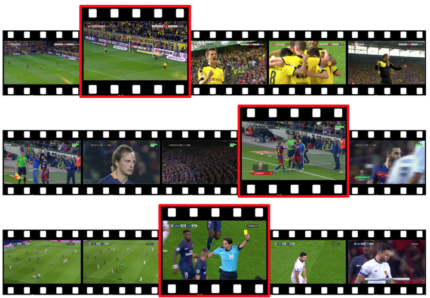

# Baselines for Action Spotting

This folder contains the different baselines for the action spotting task on SoccerNet-V2.

### Leaderboard

This table summarizes the performances of the published papers on SoccerNetv2 until August 2021. For a more updated leaderboard, please visit EvalAI [test](https://eval.ai/web/challenges/challenge-page/761/leaderboard/2072) and [challenge](https://eval.ai/web/challenges/challenge-page/761/leaderboard/2074) leaderboards.

| Model     | Avg-mAP (test)  | Paper       | Code |
| ----------| -------- | ------------------------- | ---   |
| [MaxPool](#pool-netvlad-and-maxpool)   |   18.6   | [SoccerNet: A Scalable Dataset for Action Spotting in Soccer Videos](http://openaccess.thecvf.com/content_cvpr_2018_workshops/papers/w34/Giancola_SoccerNet_A_Scalable_CVPR_2018_paper.pdf) | [Pool](Pool) |
| [NetVLAD](#pool-netvlad-and-maxpool)   |   31.4   | [SoccerNet: A Scalable Dataset for Action Spotting in Soccer Videos](http://openaccess.thecvf.com/content_cvpr_2018_workshops/papers/w34/Giancola_SoccerNet_A_Scalable_CVPR_2018_paper.pdf) | [Pool](Pool) |
| AudioVid  |   39.9   | [Improved Soccer Action Spotting Using Both Audio and Video Streams](https://openaccess.thecvf.com/content_CVPRW_2020/html/w53/Vanderplaetse_Improved_Soccer_Action_Spotting_Using_Both_Audio_and_Video_Streams_CVPRW_2020_paper.html) | [SoccerNetMultimodalActionSpotting](https://github.com/bastienvanderplaetse/SoccerNetMultimodalActionSpotting)                     |
| [CALF](#calf-a-context-aware-loss-function-for-action-spotting-in-soccer-videos)      |   40.7   | [A Context-Aware Loss Function for Action Spotting in Soccer Videos](https://openaccess.thecvf.com/content_CVPR_2020/papers/Cioppa_A_Context-Aware_Loss_Function_for_Action_Spotting_in_Soccer_Videos_CVPR_2020_paper.pdf) | [CALF](CALF)                     |
| [CC&PL_GCN](#camera-calibration-and-player-localization-top-view--gcn) |   46.7   | [Camera Calibration and Player Localization in SoccerNet-v2 and Investigation of their Representations for Action Spotting](https://arxiv.org/pdf/2104.09333.pdf) | [CALF_Calibration_GCN](CALF_Calibration_GCN)     | 
| [CC&PL](#camera-calibration-and-player-localization-top-view--gcn)     |   46.8   | [Camera Calibration and Player Localization in SoccerNet-v2 and Investigation of their Representations for Action Spotting](https://arxiv.org/pdf/2104.09333.pdf) | [CALF_Calibration](CALF_Calibration)         | 
| [NetVLAD++](#temporally-aware-pooling-netvlad) |   53.4   | [Temporally-Aware Feature Pooling for Action Spotting in Video Broadcasts](https://arxiv.org/pdf/2104.06779.pdf) | [TemporallyAwarePooling](TemporallyAwarePooling)   | 

## Camera Calibration and Player Localization: [Top View](CALF_Calibration) / [GCN](CALF_Calibration_GCN)

This is the code for the paper [Camera Calibration and Player Localization in SoccerNet-v2 and Investigation of their Representations for Action Spotting](https://arxiv.org/pdf/2104.09333.pdf) (CVSports2021), that leverages field and players localization for action spotting.

## [Temporally Aware Pooling](TemporallyAwarePooling): NetVLAD++

This is the code for the paper [Temporally-Aware Feature Pooling for Action Spotting in Video Broadcasts](https://arxiv.org/pdf/2104.06779.pdf) (CVSports2021), that introduces the baseline NetVLAD++, among other temporally-aware feature pooling modules.

## [CALF](CALF): A Context-Aware Loss Function for Action Spotting in Soccer Videos 

A custom loss function is used to explicitly model the temporal context around action spots. The main idea behind this loss is to penalize the frames far-distant from the action and steadily decrease the penalty for the frames gradually closer to the action. The frames just before the action are not penalized to avoid providing misleading information as its occurrence is uncertain. However, those just after the action are heavily penalized as we know for sure that the action has occurred.

## [Pool](Pool): NetVLAD and MaxPool

Those baseline are based on the pooling methods for action spotting introduced in the original [SoccerNet](http://openaccess.thecvf.com/content_cvpr_2018_workshops/papers/w34/Giancola_SoccerNet_A_Scalable_CVPR_2018_paper.pdf) dataset.

